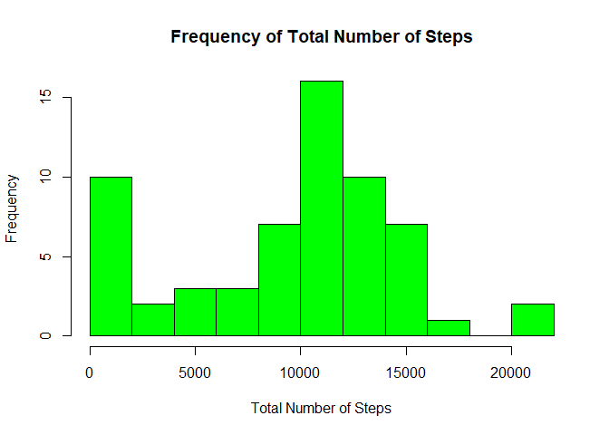
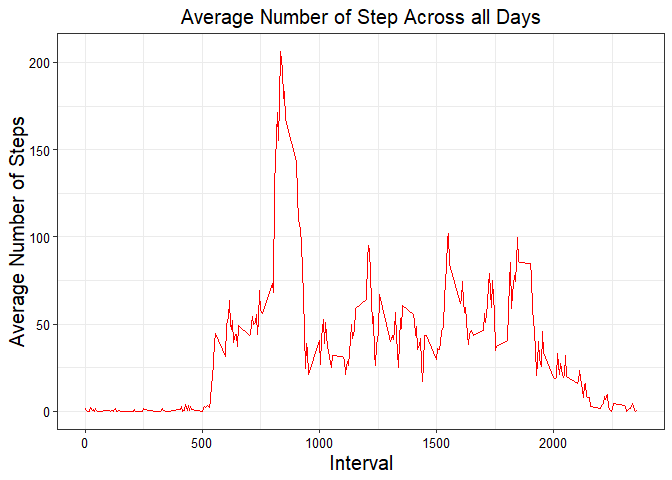
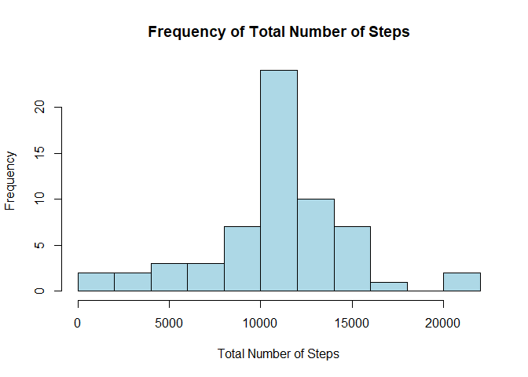
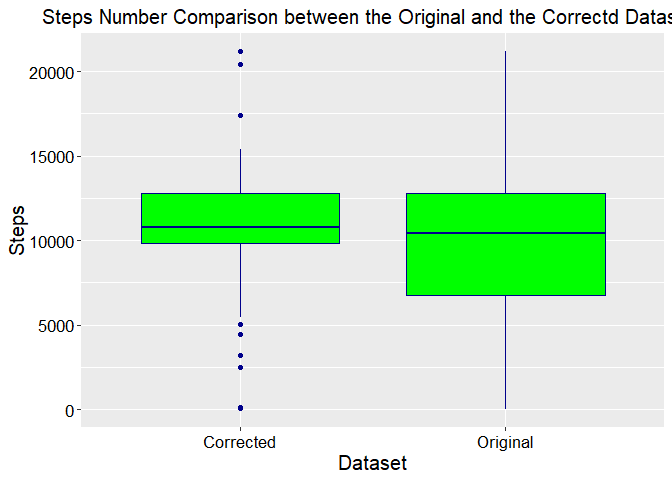
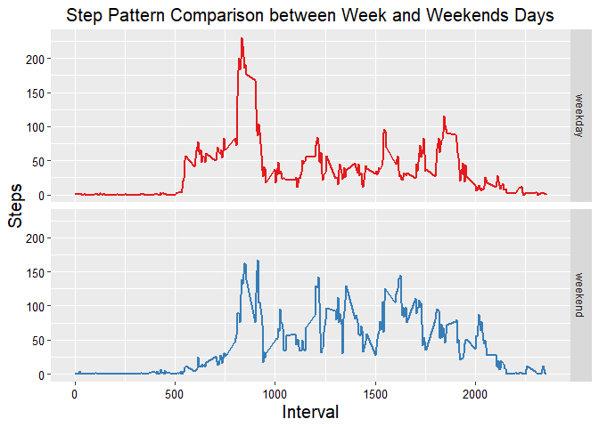

### **Introduction**

It is now possible to collect a large amount of data about personal movement using activity monitoring devices such as a Fitbit, Nike Fuelband, or Jawbone Up. These type of devices are part of the "quantified self" movement -- a group of enthusiasts who take measurements about themselves regularly to improve their health, to find patterns in their behavior, or because they are tech geeks. But these data remain under-utilized both because the raw data are hard to obtain and there is a lack of statistical methods and software for processing and interpreting the data.

This assignment makes use of data from a personal activity monitoring device. This device collects data at 5 minute intervals through out the day. The data consists of two months of data from an anonymous individual collected during the months of October and November, 2012 and include the number of steps taken in 5 minute intervals each day.

### **Loading and Preprocessing the Data**

This first part is about loading and preprocessing the data for latter analysis

#### Downloading and Extracting the Dataset


```r
file <- if(!file.exists("AMD.zip")) {
        download.file(url = "https://d396qusza40orc.cloudfront.net/repdata%2Fdata%2Factivity.zip", destfile = "AMD.zip", method = "curl")
        } else {unzip(zipfile = "AMD.zip", files = "activity.csv", overwrite = T)
}
```

#### Reading the Downloaded File

I will name the original dataset as "AMD" which stands for *"Activity Monitoring Data"*


```r
AMD <- read.csv(file = "activity.csv", header = T, sep = ",")
```

#### Preliminary Analysis
As in every analysis it would be advisable to run some exploratory analysis to have an idea of the structure of the dataset


```r
head(AMD)
```

```
##   steps       date interval
## 1    NA 2012-10-01        0
## 2    NA 2012-10-01        5
## 3    NA 2012-10-01       10
## 4    NA 2012-10-01       15
## 5    NA 2012-10-01       20
## 6    NA 2012-10-01       25
```

```r
summary(AMD)
```

```
##      steps                date          interval     
##  Min.   :  0.00   2012-10-01:  288   Min.   :   0.0  
##  1st Qu.:  0.00   2012-10-02:  288   1st Qu.: 588.8  
##  Median :  0.00   2012-10-03:  288   Median :1177.5  
##  Mean   : 37.38   2012-10-04:  288   Mean   :1177.5  
##  3rd Qu.: 12.00   2012-10-05:  288   3rd Qu.:1766.2  
##  Max.   :806.00   2012-10-06:  288   Max.   :2355.0  
##  NA's   :2304     (Other)   :15840
```

```r
str(AMD)
```

```
## 'data.frame':	17568 obs. of  3 variables:
##  $ steps   : int  NA NA NA NA NA NA NA NA NA NA ...
##  $ date    : Factor w/ 61 levels "2012-10-01","2012-10-02",..: 1 1 1 1 1 1 1 1 1 1 ...
##  $ interval: int  0 5 10 15 20 25 30 35 40 45 ...
```

Also, it is important to check for Na and its proportion in the dataset


```r
proportion <- round((mean(is.na(AMD$steps))*100), 2)
```

The proportion of NAs within the "Step" variable is 13.11%

### **What is Mean Total Number of Steps Taken per Day?**

For this section of the course project I will use the *dplyr* library. So, the first step will be to load such library


```r
library(dplyr)
```

```
## Warning: package 'dplyr' was built under R version 3.5.3
```

```
## 
## Attaching package: 'dplyr'
```

```
## The following objects are masked from 'package:stats':
## 
##     filter, lag
```

```
## The following objects are masked from 'package:base':
## 
##     intersect, setdiff, setequal, union
```

Now, before plotting the histogram for the total number of steps, we have to calculate this variable:


```r
total_steps <- AMD %>% 
                group_by(date) %>% 
                summarise(steps = sum(steps, na.rm = T)) %>% 
                select(steps)
```

I've used the select to isolate the variable "Steps" but this is not necessary. Now, lets plot the *Total Number of Steps*. It is worth noting that we have to use a histogram, so what we are really plotting is the frequency of steps number across all the collected days:


```r
plot1 <- hist(total_steps$steps, col = "green", breaks = 10, main = "Frequency of Total Number of Steps",
     xlab = "Total Number of Steps", ylab = "Frequency")
```

<!-- -->

Calculate and report the mean and median total number of steps taken per day


```r
mean_steps <- round(mean(total_steps$steps, na.rm = T), 2)
median_steps <- median(total_steps$steps, na.rm = T)
```

The maean of steps is **9354.23** and the median is **10395**

### **What is the Average Daily Activity Pattern?**
We have to Make a time series plot (i.e. type = "l") of the 5-minute interval (x-axis) and the average number of steps taken, averaged across all days (y-axis). So, first we have to calculate the average:


```r
Average_by_interval <- AMD %>% group_by(interval) %>% summarise(steps = mean(steps, na.rm = T))
```

Now we can plot the Daily Activity Pattern (I've used GGPLOT2)


```r
library(ggplot2)
```

```
## Warning: package 'ggplot2' was built under R version 3.5.3
```

```r
plot2 <- ggplot(Average_by_interval, aes(interval, steps)) + geom_line(color = "red") + theme_bw() +
        ggtitle("Average Number of Step Across all Days") + 
        ylab("Average Number of Steps") + xlab("Interval") +
        theme(axis.title.x = element_text(colour = "black", size = 15), 
              axis.title.y = element_text(colour = "black", size = 15), 
              axis.text.x = element_text(size = 10, colour = "black"), 
              axis.text.y = element_text(size = 10, colour = "black"),
              plot.title = element_text(size = 15, colour = "black", hjust = 0.5))
print(plot2)
```

<!-- -->

To answer the question about Which 5-minute interval, on average across all the days in the dataset, contains the maximum number of steps:


```r
filter(Average_by_interval, steps == max(Average_by_interval$steps))
```

```
## # A tibble: 1 x 2
##   interval steps
##      <int> <dbl>
## 1      835  206.
```

### **Imputing Missing Values**
As we have seen, there are a number of days/intervals where there are missing values (13.11%). The presence of missing days may introduce bias into some calculations or summaries of the data.

Calculate and report the total number of missing values in the dataset (i.e. the total number of rows with NAs)


```r
Total_Nas <- sum(is.na(AMD$steps))
```

The total number of rows with NAs is **2304**


Now, we have to devise a strategy for filling in all of the missing values in the dataset. I've used the mean for the 5-minute interval. So, to calculate the mean I applied the *aggregate* function. Notice that I've changed the column names of the output DF.


```r
Mean_by_interval <- aggregate(AMD$steps, by = list(AMD$interval), FUN = "mean", na.rm = T)
colnames(Mean_by_interval) <- c("Interval", "Average")
```

Create a new dataset that is equal to the original dataset but with the missing data filled in. I named the new dataset simply as New_AMD (remember that I named the original dataset as AMD)


```r
New_AMD <- AMD
```

Now, to fill the NAs with the mean of the intervals


```r
for (i in 1:length(New_AMD$steps)){
        if (is.na(New_AMD$steps[i] == TRUE)){        
                New_AMD$steps[i] <- Mean_by_interval$Average[match(New_AMD$interval[i], Mean_by_interval$Interval)]  
        } 
}
```

Make a histogram of the total number of steps taken each day and Calculate and report the mean and median total number of steps taken per day. Do these values differ from the estimates from the first part of the assignment? What is the impact of imputing missing data on the estimates of the total daily number of steps?

First we have to calculate the new Total Steps (which I named "total_steps2")


```r
total_steps2 <- New_AMD %>% group_by(date)  %>% summarise(steps = sum(steps)) %>% select(steps)
```

Now we can plot the histogram:


```r
plot3 <- hist(total_steps2$steps, breaks = 10, col = "lightblue", main = "Frequency of Total Number of Steps",
     xlab = "Total Number of Steps", ylab = "Frequency")
```

<!-- -->

Lets now calculate the mean and median fore the total number of steps with this new dataset:


```r
mean(total_steps2$steps)
```

```
## [1] 10766.19
```

```r
median(total_steps2$steps)
```

```
## [1] 10766.19
```

To assess what was the impact of imputing missing data on the estimates of the total daily number of steps I decided to make a boxplot of the step count for the original and the new (corrected) datasets. To do so first I've created a DF to use later with GGPLOT


```r
total_steps$Data_Set <- c("Original")
total_steps2$Data_Set <- c("Corrected")
DF <- rbind(total_steps, total_steps2)
```

Comparison of the Original vs. the Corrected Datasets using Boxplots


```r
plot4 <- ggplot(DF, aes(Data_Set, steps)) + geom_boxplot(color = "darkblue", fill = "green") + theme_update() +
        ggtitle("Steps Number Comparison between the Original and the Correctd Datasets") + ylab("Steps") +
        xlab("Dataset") +
        theme(axis.title.x = element_text(colour = "black", size = 15), 
              axis.title.y = element_text(colour = "black", size = 15), 
              axis.text.x = element_text(size = 13, colour = "black"), 
              axis.text.y = element_text(size = 13, colour = "black"),
              plot.title = element_text(size = 15, colour = "black", hjust = 0.5))
print(plot4)
```

<!-- -->

We can see from the plot that there isn't too much difference. Although the mean and median have changed from the original dataset ann, also, there is a narrower interquarte range, the difference not appear to be meaningful. This could relate to the fact that the NAs in the original dataset only accounted for the 13.11% of the step data.

### **Are there differences in activity patterns between weekdays and weekends?**

Create a new factor variable in the dataset with two levels -- "weekday" and "weekend" indicating whether a given date is a weekday or weekend day. To avoid overwritting the "New_AMD" I've decided to create a new dataset called "AMD3"


```r
AMD3 <- New_AMD
AMD3$date <- as.Date(AMD3$date)
AMD3 <- mutate(AMD3, weekday = weekdays(AMD3$date))
AMD3$WD_WE <- as.factor(ifelse(AMD3$weekday == "Saturday" | AMD3$weekday == "Sunday", "weekend", "weekday"))
Average_by_interval3 <- aggregate(AMD3$steps, by = list(AMD3$interval, AMD3$WD_WE), FUN = "mean")
colnames(Average_by_interval3) <- c("Interval", "Weekday", "Steps")
```

Make a panel plot containing a time series plot (i.e. type = "l") of the 5-minute interval (x-axis) and the average number of steps taken, averaged across all weekday days or weekend days (y-axis). The plot should look something like the following, which was created using simulated data:


```r
library(RColorBrewer)
plot5 <- ggplot(Average_by_interval3, aes(Interval, Steps, color = Weekday)) + geom_line(size = 1) + 
        facet_grid(Weekday~.) + scale_color_brewer(palette = "Set1") + 
        ggtitle("Step Pattern Comparison between Week and Weekends Days") +
        theme(axis.title.x = element_text(colour = "black", size = 15), 
              axis.title.y = element_text(colour = "black", size = 15), 
              axis.text.x = element_text(size = 10, colour = "black"), 
              axis.text.y = element_text(size = 10, colour = "black"),
              legend.position = "none",
              plot.title = element_text(size = 15, colour = "black", hjust = 0.5))
print(plot5)
```

<!-- -->


